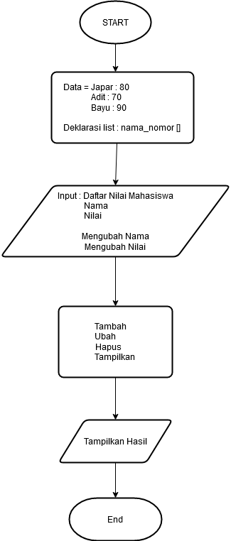
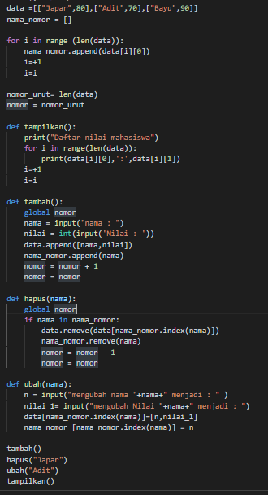
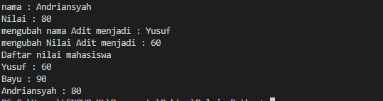

# Tugas-Praktikum-6

Nama : Andriansyah

NIM  : 312010011

Kelas : TI.20.B1

# Program Sederhana
Soal :
Buat program sederhana dengan mengaplikasikan penggunaan fungsi
yang akan menampilkan daftar nilai mahasiswa, dengan ketentuan:
• Fungsi tambah() untuk menambah data
• Fungsi tapilkan() untuk menampilkan data
• Fungsi hapus(nama) untuk menghapus data berdasarkan nama
• Fungsi ubah(nama) untuk mengubah data berdasarkan nama

Langkah awal nya buat flowchartnya terlebih dahulu 

setelah selesai buat source code nya seperti gambar dibawah ini :

Penjelasan :

- data =[["Japar",80],["Adit",70],["Bayu",90]]
    data diatas adalah list nama dan nilai yg akan kita gunakan dalam tugas ini 
- disini saya menggunakan perulangan for 
- fungsi dari len(data) itu untuk mengetahui jumlah item yang ada dalam list itu 

def tampilkan():
    print("Daftar nilai mahasiswa")
    for i in range(len(data)):
        print(data[i][0],':',data[i][1])
    i=+1
    i=i
    
- fungsi diatas itu untuk menampilkan data daftar nilai mahasiswa

- def tambah():    ==> fungsi ini untuk menambahkan data baru
- global nomor ==> fungsi ini untuk memanggil variable yg ada diluar fungsi def
- data.remove ==> fungsi ini untuk menghapus nama yg akan kita hapus yg berada dalam list diatas

def ubah(nama)  ==> ini berfungsi untuk mengubah nama yg akan kita ubah 

Hasil output nya akan seperti ini :

 Selesai.

                      
    
    

